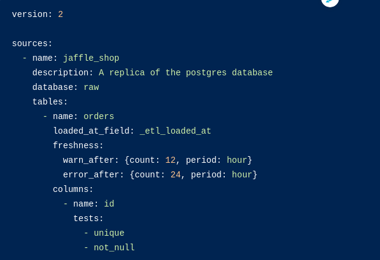

# Test  DBT with redshift


This project is intended to serve as the basis for future dbt tests with redshift. For this project, test data has been used, generating the following model:

## Model sample


## Loading training data in your warehouse
The data used in this project is stored as CSVs in a S3 bucket

Please use the instructions in *data/load_data_in_redshift.sql*

> :warning: **Ensure your user has permissions on the schemas or change them according to your convenience.

## How to run

### 1. Install dbt CLI
https://docs.getdbt.com/dbt-cli/installation

As mentioned in the official documentation, it is advisable to work with virtual python environments.

Example:

```bash
 sudo apt install python3.8-venv
 python3 -m venv dbt-env
 source dbt-env/bin/activate
 pip install dbt
```

### 2. Create a profile
- profiles.yml is located in the project folder, in order to DBT to be able to read it, an environment variable must be created as follows:

```bash
export DBT_PROFILES_DIR=$PATHTOFOLDER/backend-di--dbt-datawarehouse-test
````
- As an alternative, profiles.yml can be moved to $HOME/.dbt/profiles.yml as this is the default folder

```yaml
default:
  outputs:
    dev:
      type: redshift
      host: dataland-internal.big.dev.scmspain.io.
      user: some_user
      password: *****
      port: 5439
      dbname: dwh_sch_sp_db
      schema: dbt_redshift_shop_sample
      threads: 4
      keepalives_idle: 0 # default 0, indicating the system default
  target: dev
```

> :warning: **Ensure your user has permissions on the schemas where this model works on**

## 3. Run models

Find test files in SQL files in models/

```bash
dbt run
```

# Testing

Tests can be run against current project using a range of commands:

- **dbt test** runs all tests in the dbt project
- **dbt test --data**
- **dbt test --schema**
- **dbt test --models** one_specific_model
    
# Generate documentation

```bash
dbt docs generate
```
The generated documentation includes the following:
- Lineage Graph
- Model and column descriptions
- Schema tests added to a column
- The underlying SQL code for each model
- and more...

You can open it in /target/index.html

# Sources
## Documenting and testing sources

- Documentation and Tests are configured for models in YML files - the same is true for sources.
- In the same YML file where the sources was configured, descriptions and tests can be added. Descriptions can be added on the source, table, and column level.

models/staging/dbt_redshift_shop_sample/src_shop_sample.yml


- When the documentation is generated, sources will be documented as well.
The Lineage Graph will represent the sources in green.


## Snapshot source freshness

- Freshness thresholds can be set in the YML file where sources are configured. For each table, the keys loaded_at_field and freshness must be configured.



- A threshold can be configured for giving a warning and an error with the keys warn_after and error_after.
- The freshness of sources can then be determine with the command dbt source snapshot-freshness.

